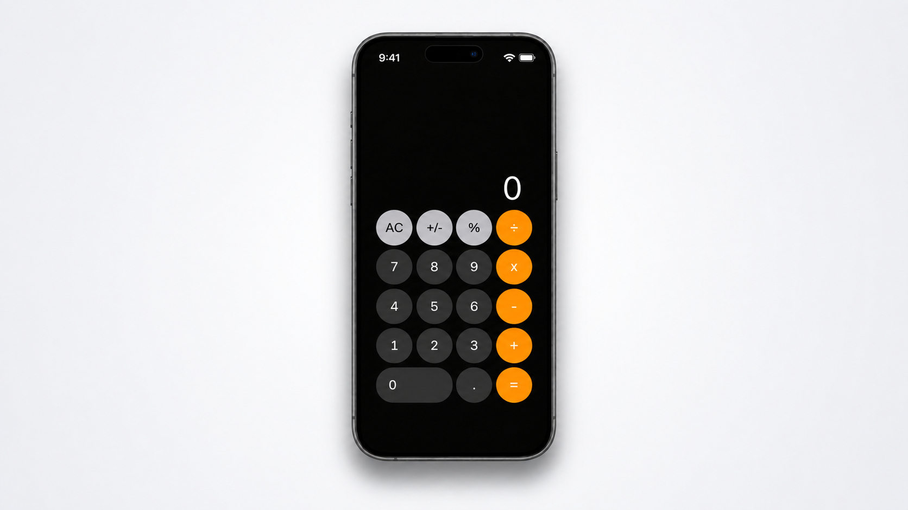

<div align="center">

# iPhone Calculator UI

Recriação visual da calculadora do iPhone, desenvolvida com HTML e CSS para praticar construção de interfaces e estilização web.

[](https://github.com/edimadev/iphone-calculator-ui)


</div>

## Demonstração

<div align="center">



</div>

## Sobre o projeto

O **iPhone Calculator UI** é meu primeiro projeto de desenvolvimento Front-End. A proposta é reproduzir a aparência da calculadora do iPhone, explorando organização de elementos com HTML e técnicas de estilização e posicionamento com CSS.

O projeto busca manter as principais características visuais da interface original, como o visor, a disposição das teclas, as cores de cada grupo de botões e a estrutura do aparelho.

> **Status atual:** esta versão é uma representação visual. Os botões ainda não executam cálculos.

## Funcionalidades visuais

- Interface inspirada na calculadora do iPhone
- Teclas organizadas em grade com CSS Grid
- Cores diferentes para números, funções e operações
- Botão zero com formato alongado
- Moldura, barra inferior e indicadores visuais do aparelho
- Sombra e plano de fundo para destacar o dispositivo

## Tecnologias utilizadas

- **HTML5** — estrutura dos elementos da calculadora
- **CSS3** — layout, cores, dimensões, posicionamento e efeitos visuais

## Como executar

Você pode visualizar o projeto localmente sem instalar dependências.

```bash
# Clone este repositório
git clone https://github.com/edimadev/iphone-calculator-ui.git

# Acesse a pasta do projeto
cd iphone-calculator-ui
```

Depois, abra o arquivo `index.html` no navegador.

## Estrutura do projeto

```text
iphone-calculator-ui/
├── images/
│   ├── barra.png
│   ├── informacoes.png
│   └── iphone.png
├── index.html
└── styles.css
```

## Aprendizados

Durante o desenvolvimento deste projeto, pratiquei conceitos como:

- Criação e organização de elementos HTML
- Construção de layouts com CSS Grid e Flexbox
- Posicionamento de elementos com CSS
- Personalização de botões, cores e bordas
- Uso de imagens e efeitos visuais na composição da interface
- Organização básica dos arquivos de um projeto web

## Próximos passos

- [ ] Implementar as operações com JavaScript
- [ ] Adicionar estados visuais ao clicar nos botões
- [ ] Melhorar a adaptação para diferentes tamanhos de tela
- [ ] Aprimorar a acessibilidade da interface
- [ ] Publicar uma demonstração com GitHub Pages

## Contribuições

Este é um projeto de estudo, mas sugestões e melhorias são bem-vindas. Você pode abrir uma [issue](https://github.com/edimadev/iphone-calculator-ui/issues) para compartilhar ideias ou relatar problemas.

## Autor

Desenvolvido por **Edima Junior**.

[](https://github.com/edimadev)

---

<div align="center">

Se este projeto foi útil para você, considere deixar uma ⭐ no repositório.

</div>

> Este projeto foi criado exclusivamente para fins educacionais e não possui vínculo ou associação com a Apple Inc.
